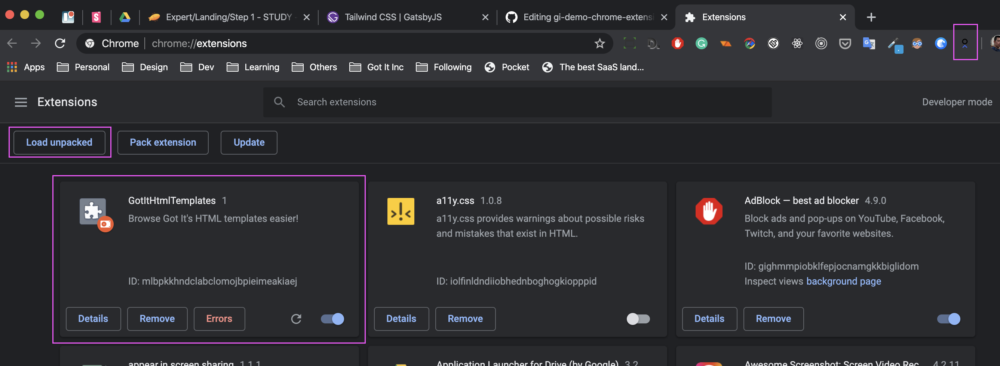

# gi-demo-chrome-extension

Learn to load a webpage into a chrome extension's popup.

## Installing

1. Download this source code to your computer and then unzip it
2. Type `chrome://extensions/` and press `Enter`
3. Click on `Load unpacked` button and select the `src` folder
4. There will be a new extension icon in the Extension-Area to work with

